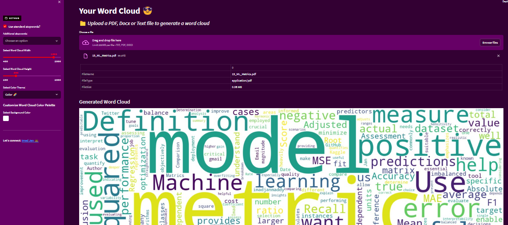

# Word Cloud Generator

Generate word clouds from PDF, Docx, or Text files with this Streamlit-based application.

## Table of Contents
- [Introduction](#introduction)
- [Features](#features)
- [Getting Started](#getting-started)
- [Usage](#usage)
- [Customization](#customization)
- [Visualization](#visualization)
- [Contributing](#contributing)
- [License](#license)

## Introduction
This project is a web-based word cloud generator built using Streamlit, Python, and various libraries like PyPDF2, Matplotlib, Plotly, and more. It allows you to upload a PDF, Docx, or Text file and generate a word cloud visualization.

## Features
- Supports PDF, Docx, and Text file formats.
- Customizable word cloud appearance and color themes.
- Provides word count statistics and visualization.
- Export word clouds and charts in various formats.
- Downloadable word count table.

## Getting Started
1. Clone this repository to your local machine.
git clone https://github.com/Imad-Jan/Word-Cloud-Generator.git
2. Navigate to the project directory.
3. Install the required Python packages.
4. Run the application.

## Usage
1. Open the application in your web browser.
2. Upload a PDF, Docx, or Text file.
3. Customize word cloud options and appearance.
4. Generate the word cloud visualization.
5. Download the word cloud image or charts as needed.

## Customization
- Choose word cloud width and height.
- Select a color theme for the word cloud.
- Customize the word cloud's background color.
- Filter stopwords and provide additional stopwords.
- Adjust the resolution and format for downloaded images.

## Visualization
The application provides various visualization options:
- **Word Cloud**: The generated word cloud image.
- **Bar Chart**: A bar chart showing the top N most frequent words.
- **Pie Chart**: A pie chart displaying the top N most frequent words as a percentage.
- **Word Count Table**: A table displaying word counts.

## Contributing
Contributions are welcome! If you have any suggestions, improvements, or bug fixes, please feel free to open an issue or create a pull request.

## License
This project is licensed under the MIT License - see the [LICENSE](LICENSE) file for details.

